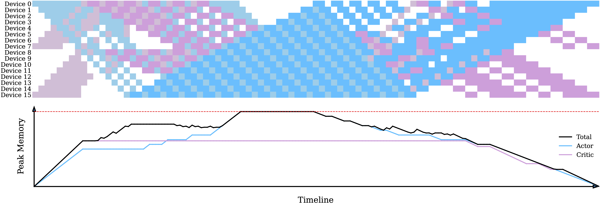

# FlexFusion

This repo reproduces the main results of the **intra-stage fusion algorithm** introduced in the paper [RLHFuse: Efficient RLHF Training for Large Language Models with Inter- and Intra-Stage Fusion](https://arxiv.org/abs/2409.13221). FlexFusion extends the original [Chimera](https://arxiv.org/abs/2107.06925) paper to any model pair and heterogeneous parallel strategy combinations which is designed for the RLHF training stage where two different models (Actor/Critic) are involved. FlexFusion utilizes a parallelized simulated annealing algorithm to generate a highly-optimized fused pipeline schedule with near-optimal latency and memory overhead. Below is an example schedule produced by it.



## Compile and Run

To compile the code, you need to have `mpicxx` installed (both mpich and OpenMPI are OK). Then you can use the following commands to compile the code:

```bash
make -j8
```

To run the example, simply execute `driver`, `parallel_driver`, or `memory_optimizer`.

## Reproduce the Results

To reproduce the results in the paper, please follow the instructions below:

- Run `parallel_driver` for every problem instance. You may invoke it like `mpirun -H <host-list> -n <num-cpus> ./parallel_driver <exp-name>`. We recommand at least 512 CPUs. The results will be saved in `results/trace_<exp-name>.txt`.
- If you are not satisfied with the memory usage of a solution, you can run `memory_optimizer` to optimize it. You may invoke it like `./memory_optimizer <exp-name>`. It will automatically open `results/trace_<exp-name>.txt`, optimize its memory usage, and save the optimized solution in `results/trace_<exp-name>.txt.mem-optimized-<timestamp>`.

## Files

- `DualEgoSolver.h`: Implement `DualEgoSolver` - a single threaded solver for the problem based on simulated annealing. It also provides basic structures (e.g. simulated annealing configuration) and utility functions (e.g. visualization).
- `driver.cc`: An example of using `DualEgoSolver` to solve a problem instance.
- `ParallelDualEgoSolver.h`: Implement `ParallelDualEgoSolver` - a MPI-based multiprocess solver for the problem. It's a wrapper around `DualEgoSolver` and provides parallelism.
- `parallel_driver.cc`: An example of using `ParallelDualEgoSolver` to solve a problem instance in parallel.
- `memory_optimizer.cc`: A program which use OpenMP to optimize the memory usage of a particular solution found by `parallel_driver.cc`.
- `get-lower-bound.py`: A tool that calculates a lower bound of the problem instance.
- `useless/dp.cpp`: Another solver of the problem based on dynamic programming. Although it is able to find the optimal solution, it's too slow thus not presented in the paper.

## Implementation Details

We have the following classes/structures in `DualEgoSolver.h`:

- `ModelMeta`: A structure that stores the meta information of a model. (A problem can be described by a series of `ModelMeta`s, each of which represents a model.)
- `TraceItem`: An item in `Trace`
- `Trace`: A trace that represents a solution. It contains a series of `TraceItem`s, and some metadata like the e2e time usage
- `TraceMetric`: A structure that stores the metrics of a trace. (e.g. peak_memory_usage)
- `SimAnnealConfig`: Configuration for simulated annealing
- `Task` and `TaskSched`: A simplified version of `Trace`, which only contains `model_id` and `is_bwd`. This structure is used inside the simulated annealing algorithm.

And `DualEgoSolver` has the following interfaces exposed:

- `TaskSched get_init_task_sched(sim_anneal_init_t init_method)`: Get the initial task schedule for simulated annealing.
- `TaskSched optimize_e2e_time(const SimAnnealConfig &config, TaskSched const& task_sched)`: Optimize the e2e time of a task schedule.
- `TaskSched optimize_peak_memory(const SimAnnealConfig &config, TaskSched const& task_sched)`: Optimize the peak memory usage of a task schedule.
- `Trace task_sched2trace(TaskSched const& task_sched)`: Convert a task schedule to a trace.
- `Trace solve_greedy()`: Solve the problem using a greedy algorithm.
- `void print_trace(Trace const& trace, FILE* fp = stdout)`: Print the given trace to stdout or a file.

In `ParallelDualEgoSolver`, the process of rank 0 will be the master, while the others will be workers. The user specifies a set of simulated configurations for e2e time optimization (list as `le`) and for peak memory optimization (list as `lm`). The workers will first ask the master for an element in `le`, and try to do the optimization. After performing the e2e optimization, it communicates with the master to check whether the latency is optimal, and if it is, it will try to optimize that e2e solution under every configuration in `lm`.

In `memory_optimizer`, we just use OpenMP to let every thread optimize the memory usage of a solution under a particular simulated annealing configuration.

## Citation

If you find this project useful, please cite:

 [Optimizing RLHF Training for Large Language Models with Stage Fusion](https://arxiv.org/abs/2409.13221)

```
@article{zhong2024rlhfuseefficientrlhftraining,
      title={Optimizing RLHF Training for Large Language Models with Stage Fusion}, 
      author={Yinmin Zhong and Zili Zhang and Bingyang Wu and Shengyu Liu and Yukun Chen and Changyi Wan and Hanpeng Hu and Lei Xia and Ranchen Ming and Yibo Zhu and Xin Jin},
      year={2024},
      journal = {arXiv preprint arXiv: 2409.13221}
}
```
